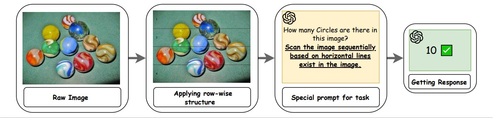
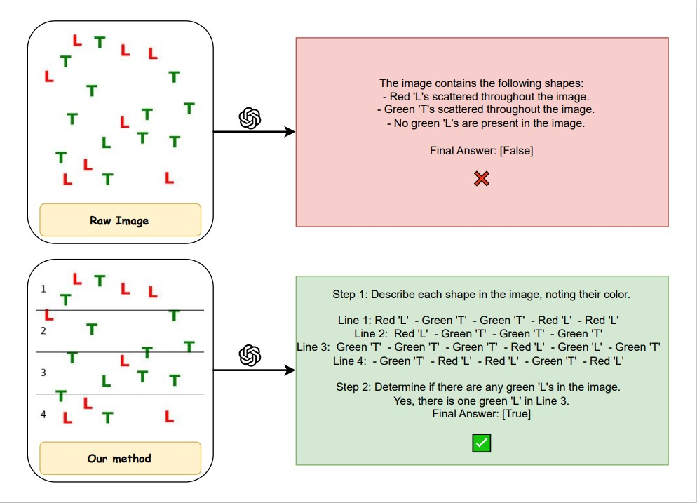
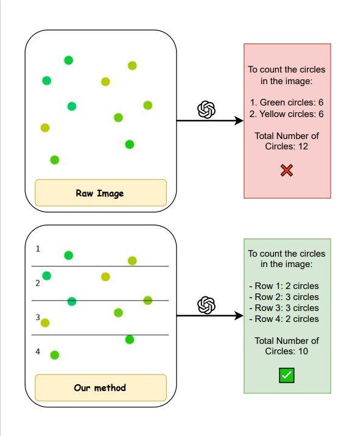
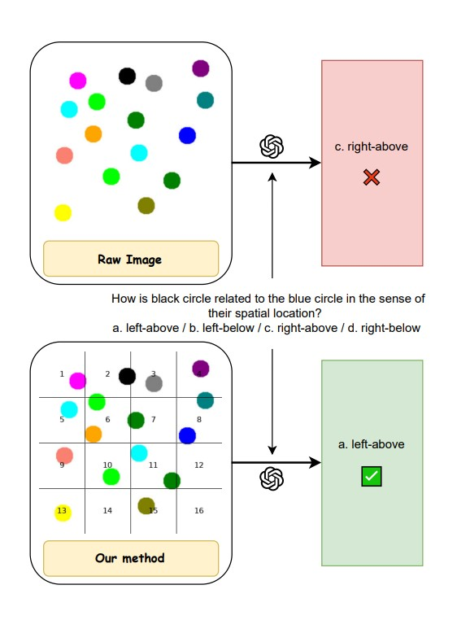
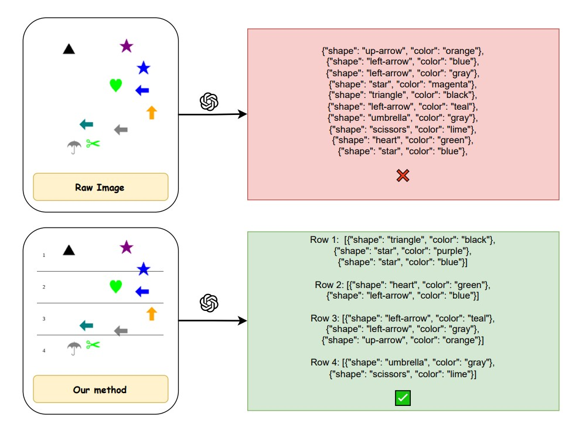

# Visual Structures Helps Visual Reasoning: Addressing the Binding Problem in VLMs
\[[Read our arXiv Paper](https://arxiv.org/pdf/2506.22146)\] 

Amirmohammad Izadi,Mohammad Ali Banayeeanzade, Fatemeh Askari,Ali Rahimiakbar,Mohammad Mahdi Vahedi, Hosein Hasani,Mahdieh Soleymani Baghshah


### Introduction
<div style="text-align: justify">

Despite recent advancements in **Vision-Language Models (VLMs)**, these models often struggle with tasks that require associating visual features—like shape and color—with their correct positions. This issue, known as the *binding problem*, leads to failures in tasks such as **counting**, **visual search**, **scene description**, and understanding **spatial relationships**.

Our work introduces a simple but powerful fix: we add lightweight **visual structures** (e.g., horizontal lines) to the images and pair them with task-specific prompts that guide the model to reason in a **spatially grounded**, sequential manner. As shown in the example below, this structured setup helps models like **GPT-4o** reason more accurately—achieving significant improvements across multiple tasks.

</div>
<p align="center">  </p>

## Installation

To set up the environment and install the required dependencies for this project, follow the steps below.

```bash
git clone https://github.com/FatemehAskari/VLM_Reasoning.git
cd code
pip install --upgrade pip 
pip install -r requirements.txt
```

## Dataset

To generate the datasets used in our experiments, navigate to the `data/task_scripts` directory. Each dataset is generated using a Python script with configurable arguments, and supports both 2D and 3D visual settings (for Visual Search, Counting, and Scene Description).

---

### 🔧 Dataset Generation Commands

```bash
# Navigate to script directory
cd data/task_scripts

# Generate Visual Search Datasets

#2D
python gen_vlm_search.py --n_objects 5 10 15 20 25 30 35 40 45 50 \
                                      --n_trials=100 \
                                      --size=22 \
                                      --use_letters=True \
                                      --colors green red \
                                      --output_dir=data/vlm/search

#3D
<BLENDER_PATH>/blender -b -P gen_blender_search.py


# Generate Counting Datasets

# 2D
python gen_vlm_counting.py --object_inds=37 \
                                        --n_trials=100 \
                                        --n_shapes 1 2 3 4 5 6 7 8 9 10 11 12 13 14 15 16 17 18 19 20 \
                                        --size=40 \
                                        --all_black=True \
                                        --output_dir=data/vlm/counting_black

#3D
<BLENDER_PATH>/blender -b -P gen_blender_counting.py

# Generate Scene Description Datasets

# 2D
python gen_vlm_binding.py \
  --n_objects 10 15 20 \
  --n_trials 20 \
  --size 42 \
  --color_names red magenta salmon green lime olive blue teal yellow purple brown gray black cyan orange \
  --shape_names airplane triangle cloud cross umbrella scissors heart star circle square infinity up-arrow pentagon left-arrow flag \
  --shape_inds 6 9 21 24 34 60 96 98 100 101 5 22 59 13 35 \
  --output_dir ../vlm/reasoning/2d

#3D
<BLENDER_PATH>/blender -b -P gen_blender_binding.py

# Generate Reasoning Dataset
python gen_binding_trace.py

```

## Running the Pipeline

### Dataset Inference
You can process the generated 2D/3D datasets using either Close-source or Open-source models: 

####  Close-Source

```bash
cd code 
python closed_source/Scene_Description/code.py \
    --mode simple \
    --dimension 2d \
    --input ../data/scene_description/2D/base_data \
    --output ../outputs/scene_description/2D/simple_json
```
This will run GPT-4o on your dataset and save the parsed JSON results to the specified output path.

You can swap GPT-4o with other vision-capable LLMs, such as Claude-Sonnet or LLaMA4, by modifying the model and base_url values in your .env file—ensuring the API remains compatible with ChatOpenAI.

You may also adjust the --mode, --dimension, --input, and --output arguments to apply the same script to other tasks such as counting, visual search, scene description, or 3D variants. The core processing logic remains unchanged.

####  Open-Source
You can process your dataset using the following command:

```bash
cd code 
python open_source/qwen_2D.py \
    --mode row \
    --input data/scene_description/row_data \
    --output results/scene_description/row_output
```

### Reasoning Trace 

This task involves analyzing an image of squares distributed across 4 horizontal rows and assigning each object to the correct row. You can run it using the script below.

You can run the reasoning trace script using the following example:

```bash
cd code 
python run_reasoning_trace.py \
    --mode row \
    --input data/reasoning_trace/row_images \
    --output results/reasoning_trace/row_outputs
```

Once the reasoning trace predictions have been generated and saved, you can evaluate the results using the following scripts:

```bash
cd utils
python create_json.py
python evaluate_binding_reasoning.py
python result.py
```

## Example
Below are example visual reasoning inputs across four core tasks in our benchmark:

| Task                   | Example Image                              | Description                                                                 |
|------------------------|--------------------------------------------|-----------------------------------------------------------------------------|
| **Visual Search**      |  | Identify a target object (e.g., green triangle) among distractors.         |
| **Counting**           |   | Count the number of specific objects, considering both shape and color.    |
| **Spatial Relationship** |  | Determine spatial relationships like "left of" or "above" among objects.   |
| **Scene Description**  |   | Describe a scene by listing all objects with correct shape and color.      |


## Citation
```bash
@article{izadi2025visual,
  title={Visual Structures Helps Visual Reasoning: Addressing the Binding Problem in VLMs},
  author={Izadi, Amirmohammad and Banayeeanzade, Mohammad Ali and Askari, Fatemeh and Rahimiakbar, Ali and Vahedi, Mohammad Mahdi and Hasani, Hosein and Baghshah, Mahdieh Soleymani},
  journal={arXiv preprint arXiv:2506.22146},
  year={2025}
}
```


